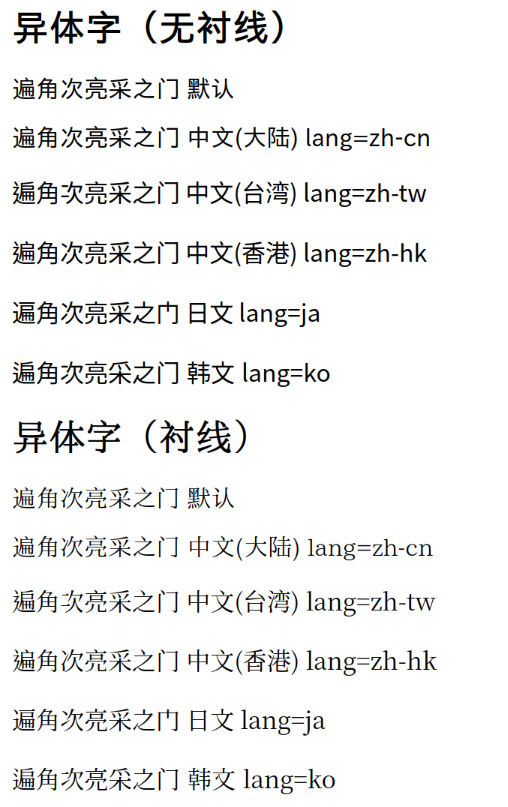

# 使用 Fontconfig 治理 Linux 字体

## 前言

### 为什么会有这个指南

- 我浏览过许多介绍 fontconfig 配置的文章，但大多数配置难于理解和维护，要么是复制粘贴不求甚解。
- 官方文档实在是晦涩难懂。

### 配置路径

- 有一些说法，号称直接修改 `/etc/fonts/` 下的配置文件最为简单。可千万别这么做！如果改动过，请恢复原始文件。
- 正常来讲，应该把我们的配置文件加入家目录下的 `~/.config/fontconfig/`。
- 如果文件过于冗长，可以采取 `conf.d` 进行拆分。

::: danger ⚠️ 警告
随意修改系统配置文件不是一个好习惯，请牢记。
:::

### 字体合成

&emsp;&emsp;fontconfig 的字体匹配机制为 Linux 程序提供了字体加载列表， 按先后顺序依次渲染字体。这意味着什么？这意味着不再需要那些合成字体了。  
&emsp;&emsp;举个简单的例子，你想要使用 `JetBrains Mono` 字体作为等宽字体，使用 `Nerd Fonts` 字体提供 NF 图标，使用 `Twemoji` 字体提供 `Emoji`，使用 `MiSans` 提供中文字体，使用 `MiSans L3` 提供生僻字，同时你的电脑上安装了许多的字体，正常情况下不会按照你想要的顺序加载。  
&emsp;&emsp;现在给你 1 分钟时间，思考怎么办。  
&emsp;&emsp;一个通用的办法就是用字体合并工具，按顺序合并这些字体，看起来没有问题对吧。  
&emsp;&emsp;现在某一个字体更新了，你又需要合并一次，过几天另一个字体更新了，再来一次，是不是感觉哪里不太对。  
&emsp;&emsp;让我们来看看 Arch Linux 上有多少打过补丁的 NF 字体：[ArchLinux-Nerd-Font](https://archlinux.org/groups/any/nerd-fonts/)。  
&emsp;&emsp;截至本文撰写时间（2025-03-29），67 种。是不是感觉不可思议。但这确实是现在的字体常态。所以我们需要 fontconfig 的字体合成功能。来看以下内容：

```xml
<match target="pattern">
    <test name="family">
        <string>sans-serif</string>
    </test>
    <edit binding="strong" mode="prepend" name="family">
        <string>Noto Sans CJK SC</string>
        <string>Iosevka Aile</string>
        <string>Twemoji</string>
    </edit>
</match>
```

这种 font fallback 的方式，即可让程序按照以下顺序渲染字体：

```txt
Noto Sans CJK SC -> Iosevka Aile -> Twemoji
```

&emsp;&emsp;在此我优先指定中英文使用 Noto Sans CJK SC 来渲染，西文使用 Iosevka Aile 渲染，emoij 使用了字体 Twemoji。  
&emsp;&emsp;那么还有很多没指定的字形怎么办呢，比如日文，韩文，火星文？没关系，那些都是系统配置中解决的，只要安装了相应字体，fontconfig 自然能帮我找到它们。  
&emsp;&emsp;同时，即使我系统里有多个中文字体，也能保证程序使用 Noto Sans CJK SC 渲染字体而不是别的中文字体。

::: info 好耶！
上两句话都是骗你的。😕  
为什么下文会讲。
:::

## 简单测试一下你的字体

使用以下 html 代码测试你的浏览器字体支持情况：

```html
<h2><div style="font-family: sans-serif">异体字（无衬线）</div></h2>
<div style="font-family: sans">
  <p>遍角次亮采之门 默认</p>
  <p lang="zh-cn">遍角次亮采之门 中文(大陆) lang=zh-cn</p>
  <p lang="zh-tw">遍角次亮采之门 中文(台湾) lang=zh-tw</p>
  <p lang="zh-hk">遍角次亮采之门 中文(香港) lang=zh-hk</p>
  <p lang="ja">遍角次亮采之门 日文 lang=ja</p>
  <p lang="ko">遍角次亮采之门 韩文 lang=ko</p>
</div>
<h2><div style="font-family: serif">异体字（衬线）</div></h2>
<div style="font-family: serif">
  <p>遍角次亮采之门 默认</p>
  <p lang="zh-cn">遍角次亮采之门 中文(大陆) lang=zh-cn</p>
  <p lang="zh-tw">遍角次亮采之门 中文(台湾) lang=zh-tw</p>
  <p lang="zh-hk">遍角次亮采之门 中文(香港) lang=zh-hk</p>
  <p lang="ja">遍角次亮采之门 日文 lang=ja</p>
  <p lang="ko">遍角次亮采之门 韩文 lang=ko</p>
</div>
```

[你也可以在线测试。](/fontconfigtest.html){target="\_self"}  
如果你的字体配置一切正确，那么结果应如图所示：


